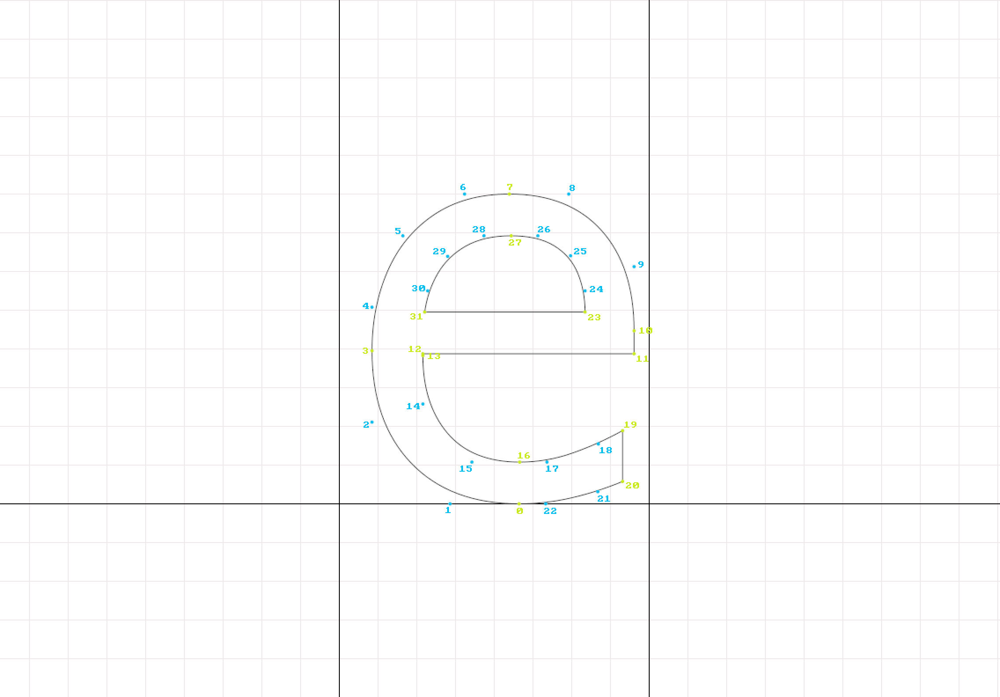
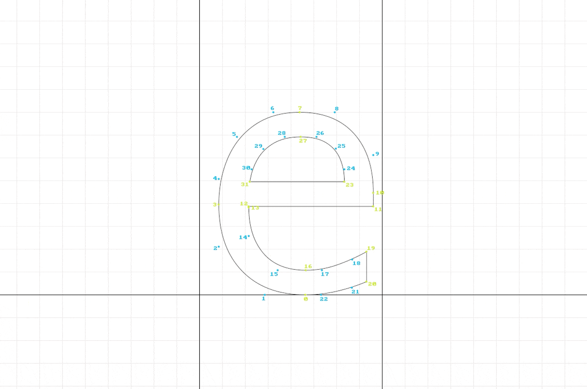
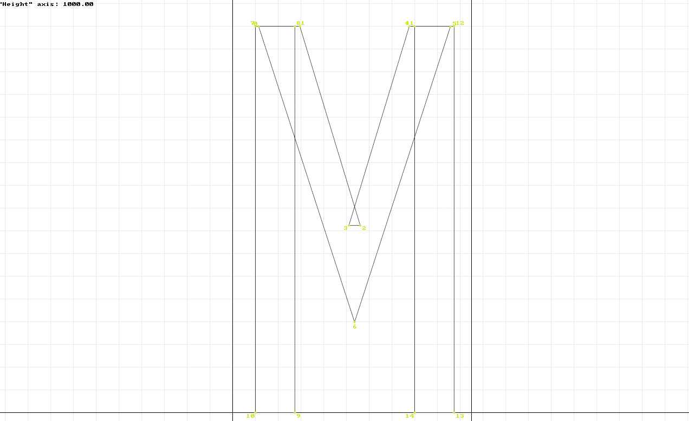

# Manual ttfautohint Instruction Set Adjustments

## About

This document describes an approach to view and manually adjust the automated [`ttfautohint`](https://www.freetype.org/ttfautohint/) bytecode instruction sets in TrueType font binaries with delta exceptions.

## Audience

Typeface developers who need an iterative workflow to view and modify the automatic bytecode instruction sets that are defined during execution of the `ttfautohint` executable on TrueType font binaries (`*.ttf` files).

## Terminology

- **Control instructions files** (CIF) - `ttfautohint` scripts that define delta exceptions
- **Delta exceptions** - type size-specific x-axis and y-axis adjustment definitions for individual (or sequential ranges of) points in glyph outlines

## Background

[`ttfautohint`](https://www.freetype.org/ttfautohint/doc/ttfautohint.html) is a free software tool that automates script-specific [feature analysis](https://www.freetype.org/ttfautohint/doc/ttfautohint.html#feature-analysis), [computation of appropriate blue zones](https://www.freetype.org/ttfautohint/doc/ttfautohint.html#blue-zones), and [definition of type size-specific optimal hint sets](https://www.freetype.org/ttfautohint/doc/ttfautohint.html#hint-sets) in TrueType fonts (`*.ttf`) using data from the FreeType auto-hinting module.  The automated instruction sets are defined on the horizontal axis only leading to vertical-only hinting.  A deeper dive into the technical details of this process is available in the [ttfautohint Background and Technical Details](https://www.freetype.org/ttfautohint/doc/ttfautohint.html#background-and-technical-details) section of the documentation.

`ttfautohint` supports manual modification of the instructed shapes at given type sizes through the use of [delta exception](https://www.freetype.org/ttfautohint/doc/ttfautohint.html#delta-exceptions) definitions that are stored in [control instructions files](https://www.freetype.org/ttfautohint/doc/ttfautohint.html#control-instructions).  The type developer can manually master fonts with x- and y-axis instruction set modifications of outline point positions at a granularity of 1/8 pixel dimension and define points in the shape that should not be interpolated. These modifications lead to appropriately adjusted calculations of all interpolated "untouched" points in the outline between the "touched" points as defined by the automated ttfautohint algorithm and modified definitions in delta exceptions that are specified by the type developer.

This document describes an approach to review glyph outlines at any desired pixel per em size (ppem = point size when viewed at 72 dpi), identify glyph-specific outline point numbers for use in the definition of delta exceptions, and apply the delta exceptions in control instructions files with the `ttfautohint` tool.  The approach is an iterative mastering process that allows the developer to review size-specific shapes, modify instruction sets where necessary, re-compile + re-hint fonts, and then view the shapes with modified instruction sets.


## Installation of Tools

The approach described here requires the following free software tools:

- FreeType 2 library ([Source](https://git.savannah.gnu.org/cgit/freetype/freetype2.git/))
- `ttfautohint` executable application ([Source](https://git.savannah.gnu.org/cgit/freetype/freetype2-demos.git/))
- `ftgrid` freetype2-demo tool - Source Foundry customized branch ([Source](https://github.com/source-foundry/freetype2-demos))


### Compile FreeType 2 library

The following is a generic approach to compilation of the FreeType 2 library for use in this workflow.  For more detailed instructions, including necessary dependencies on your platform, please refer to the [FreeType project documentation](https://www.freetype.org/download.html).

```sh
$ curl -L -O https://download.savannah.gnu.org/releases/freetype/freetype-2.9.1.tar.gz
$ tar -xvzf freetype-2.9.1.tar.gz && rm freetype-2.9.1.tar.gz
$ mv freetype-2.9.1 freetype2
$ cd freetype2
$ ./configure && make
$ cd ..
```


### Compile `ftgrid` executable

**Important**: 

- *Pull the freetype2-demos directory to the root directory that contains the `freetype2` directory created in the FreeType 2 library compile steps above.  The directory renaming to `freetype2` in the instructions above is mandatory to compile the freetype2-demos tools that contain `ftgrid`.*
- *This application requires the X11 Window system.  See the [freetype2-demos README](https://git.savannah.gnu.org/cgit/freetype/freetype2-demos.git/tree/README) for details on how to install this dependency. macOS users please note that you must install XQuartz **before** you compile the freetype2-demos tools (see issue [#5](https://github.com/source-foundry/manual-ttfa/issues/5)) or you will receive a `could not allocate display surface` error message when you attempt to use `ftgrid`.*

This approach uses the [Source Foundry branch of the freetype2-demos tools](https://github.com/source-foundry/freetype2-demos) (cs-custom branch) that includes source modifications to improve support of this workflow.  The upstream project source is available at https://git.savannah.gnu.org/cgit/freetype/freetype2-demos.git/ if you prefer to use the default tool builds as released by the FreeType project. Just swap the URL for the source in the `git clone` step and proceed with the rest of the compile instructions.

```sh
$ git clone https://github.com/source-foundry/freetype2-demos.git
$ cd freetype2-demos
$ make
```

The `ftgrid` executable can be found in the `bin` directory following the `make` step.  You can execute `ftgrid` without installing the file on your system PATH by changing to the `bin` directory and executing the file with the `./` idiom before the file name.  Test your executable by printing the version with:

```sh
$ ./ftgrid -v
```

### Install ttfautohint

Install `ttfautohint` using [the platform-specific instructions in the ttfautohint documentation](https://www.freetype.org/ttfautohint/doc/ttfautohint.html#compilation-and-installation) or the [ttfautohint-build project README](https://github.com/source-foundry/ttfautohint-build).

## Workflow

### 1. View hinted glyph shapes at target size with `ftgrid`

The syntax for `ftgrid` is:

```sh
$ ./ftgrid [-w WINDOW_WIDTH] [-h WINDOW_HEIGHT] [-f GLYPH_INDEX] POINT_SIZE FONT_PATH
```

For example, to open glyph index # 139 in the font `GenericSans-Regular.ttf` in a 1280x960px window at a type size of 14ppem, use the following command:

```sh
$ ./ftgrid -w 1280 -h 960 -f 139 14 GenericSans-Regular.ttf
```

The glyph opens in an X11 window and displays the hinted outline (if previously hinted) and all on- and off-curve points with associated numbers used by `ttfautohint` to identify the points.



Toggle the outline and on-curve point opacity by typing <kbd>SHIFT</kbd> + <kbd>C</kbd>:



And toggle bitmap display by typing <kbd>b</kbd>:


If you are working with a variable, Multiple Master, or GX font, you can cycle through the axes with <kbd>F2</kbd>, and increase or decrease their value by <kbd>F3</kbd> or <kbd>F4</kbd> respectively. For example, this glyph has a height axis:



Other helpful key mappings include:

- transition view up and down by 0.5ppem steps with the <kbd>↑</kbd> Up and <kbd>↓</kbd> Down arrow, respectively
- transition view to previous or next glyph index in the font with the <kbd>←</kbd> Left and <kbd>→</kbd> Right arrow, respectively
- quit the application by typing <kbd>q</kbd>

You can view all key mappings with <kbd>F1</kbd>, or <kbd>SHIFT</kbd> + <kbd>?</kbd>.

### 2. Identify points that require position adjustments with `ftgrid`

Select the points that require position adjustments by number in the views above.

### 3. Create delta exceptions with text editor

Delta exceptions are defined with text and can be created with any text editor.

The delta exception syntax is:

```
glyph‑id  touch  POINT(S)  [ x X-SHIFT_VALUE ]  [ y Y-SHIFT_VALUE ]  @  PPEM(S)
```

#### y Deltas

To shift the segment defined by points 11 and 12 down by 1/2 pixel at size 14 ppem, create the following delta exception:

```
uni0065 touch 11,12 y -0.5 @ 14
```

To shift the segment defined by points 11 and 12 up by 1/2 pixel at size 14 ppem, create the following delta exception:

```
uni0065 touch 11,12 y 0.5 @ 14
```

#### x Deltas

*Please note that x deltas are ignored if ClearType is active*.

Horizontal changes are defined in the same way; however, you use the `x` argument to define the x-axis.  To shift the segment defined by points 11 and 12 right by 1 pixel at size 14 ppem, create the following delta exception:

```
uni0065 touch 11,12 x 1.0 @ 14
```

#### Range values

Delta exception syntax supports range values in point number and ppem size definitions.  For example, to shift points 11, 12, 13, 14, 15 up on the y axis by 0.5 pixel at 8-14 ppem sizes, you would define the delta exception like this:

```sh
uni0065 touch 11-15 y 0.5 @ 8-14
```


### 4. Draft control instructions files with text editor

Save all delta exceptions that apply to a font as a text file on any path local to the font file(s).  Define the delta exceptions in a one delta exception per line format.  You can use the `#` symbol at the beginning of a line to define the line as a comment (e.g., to describe the delta exception that follows on the next line).  All extra whitespace characters in lines are ignored so it is acceptable to use spaces and tabs within delta exception lines to format the document. Empty lines are acceptable and are ignored by `ttfautohint`.

There is no specification for file path naming.  We generally name our files with the following pattern:

```sh
[FAMILY NAME]-[INSTANCE NAME]-TA.txt
```

For example, the delta exceptions for the `GenericSans-Regular.ttf` font could be defined with the `GenericSans-Regular-TA.txt` file. You cannot combine delta exceptions intended for more than one font in the same CIF. This means that the CIF should map 1:1 with font binaries that are hinted with ttfautohint. You can store these CIF on any local path that is accessible to `ttfautohint` during execution.  These CIF should be included in git version control and pushed to remote repositories and/or remote CI testing services when typeface sources are remotely compiled.

### 5. Apply new delta exceptions with `ttfautohint`

Add the `-m` definition flag and file path argument to your existing `ttfautohint` options to indicate (1) that delta exceptions apply to the font; (2) the path to the CIF that contains the delta exceptions:

```sh
ttfautohint [YOUR OPTIONS] -m "cif/GenericSans-Regular-TA.txt" "ttf/GenericSans-Regular.ttf" "ttf/hinted/GenericSans-Regular.ttf"
```


After you compile and hint your fonts with the new delta exceptions, return to step one and begin the iterative workflow from the top to view the changes that occurred in the glyph shape and make any other necessary adjustments to the shape, or to any other shape in the glyph set.

## Acknowledgments

CS would like to thank Werner Lemberg for his technical review of this article, assistance with the development of the downstream `ftgrid` source that is discussed here, and for the excellent `ttfautohint` software.


